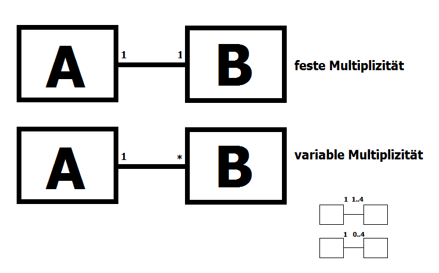

    Quellcode einrücken [Alt] + [Umschalt] + [F]

##sortierte Kollektionen 10/20/2014 8:00:00 AM 

* einige Kollenktionen fügen die Elemente &lt;E&gt; auf Basis einer Sortierreihenfolge ein

<u>Tree</u>Set

    F, A, B, C, D, I

			(C)
		   /   \
		 (B)   (F)
         /     / \
	   (A)	 (D) (I)

			(3)
		   /   \
		 (2)   (5)
         /     / \
	   (1)	 (4) (6)

TreeSet<Integer> -&gt; sortiert nach den Zahlenwert    
TreeSet<String> -&gt; lexikografische Ordnung    
TreeSet<Car> -&gt; ???

- die sortierten Kollektionen erwarten, dass die Argumente für die generische Typparameter Klassen sind, deren Objekte sich vergleichen lassen
- in diesem Sinne vergleichbar wären Klassen, die 
    1. von Compareator ableiten
    2. Comparable implementieren
- sowohl bei der Ableitung als auch der Implementierung dreht sich alles um die <u>abstrakte</u> Methode **compare**

- das Interface Comparable erwartet die Implementierung der abstrakten Methode **compareTo**

    													dependency injection
    TreeSet&lt;HoppeCar&gt; thc = new TreeSet&lt;&gt;(new MileageCoparator())
    TreeSet&lt;HoppeCar&gt; thcA = new TreeSet&lt;&gt;(new HorsePowerCoparator())
														dependecy injection

##Map 10/20/2014 4:00:00 PM 

    Key => Value

<u>Hash</u>Map, <u>Tree</u>Map

TreeMap -&gt; sortierte Map   
HashMap -&gt; Hashfunktion beschleunigt den Zugriff auf die Elemente    

	class HashMap<K, V>
	//K -> Typ der Schlüsselwerte
	//V -> Typ der gemappten Werte

##Klassen- und Objektbeziehungen 10/21/2014 8:14:02 AM 

- es gibt 3 Arten von Objektbeziehungen

- für die Implementierung der Beziehungen in einer OOP-Sprache sind weitere Kriterien zu beachten
    1. Richtung der Beziehung, in welcher Klasse muss die Beziehung gespeichert werden
    2. Multiplizität/Kardinalitäten, auf welche Art werden die Beziehungen gespeichert (skalare Objektvariablen, Datenstrukturen)

1. Richtung der Beziehung

2. Multiplizitäten / Kardinalitäten

- Speichern der Beziehungen

0, 1 -&gt; skalare Variablen
     
	class A{    
		B b = null;    
	}    

1 .. 4 -&gt; Datenfelder

	class A{    
		B [] b = new B[4];
	} 

 -&gt; Kollektionen

- Methoden zum Verwalten der Beziehung
	1. das Herstellen einer Beziehung wollen wir abstrakt als **setLink()** bezeichnen
	2. das Löschen einer Beziehung wollen wir abstrakt als **removeLink()** bezeichnen
	3. das Abfragen einer Beziehung wollen wir abstrakt als **getLink()** bezeichnen
		1. das Abfragen aller Beziehungen **getAllLinks()**

Bsp.:

##Entwurfsmuster 10/22/2014 2:04:51 PM 

- sind in der OOP eingesetzte, praktisch bewährte Herangehensweisen an bestimmte Gruppen von Aufgabenstellungen
- "Gang Of Four" (GOF) haben Entwurfsmuster definiert nach folgenden Kategorien:
	1. Erzeugungsmuster, Wie kann man Objekte "sinnvoll" erzeugen?
	2. Verhaltensmuster, Wie kann Verhalten am besten in Klassen umgesetzt werden? (Iterator)
	3. Strukturmuster, Beschreiben sinnvolle Klassenhierachien zum speichern von Informationen.

###Erzeugungsmuster

1. Singleton
	- stellt sicher, dass es von einer Klasse immer nur genau eine Instanz gibt
	- dazu wird die Kontrolle über das Erzeugen des Objekts in die Klasse verlagert
	- die Klasse stellt eine Methode bereit, damit von außen auf die Instanz zugegriffen werden kann **getInstance()**
	- diese Methode ist static, Klasse.getInstance()
	- alle anderen Möglichkeiten, Instanzen der Klasse zu bekommen werden deaktiviert
	- (a) die Konstruktoren der Klasse werden **private**
	- (b) **clone()** wird privatisiert 

###Beispiel1 Klasse Singleton

	private static Singleton instance = null;

	private Singleton(){
        
    }
    
    @Override
    protected Object clone() throws CloneNotSupportedException{
        throw new CloneNotSupportedException();
        
        
    }

    public static Singleton getInstance(){

		if(instance == null)
			instance = new Singleton();

		return instance;
	}
	
###Beispiel2 Klasse Singleton

	private static Singleton instance = new Singleton();

	private Singleton(){
        
    }
    
    @Override
    protected Object clone() throws CloneNotSupportedException{
        throw new CloneNotSupportedException();
        
        
    }

	public static Singleton getInstance(){
        
        return instance;
                
    }

- das Muster führt zu Klassenkontrollierten Instanzen
- das Muster wird immer dann eingesetzt, wenn nur eine Instanz der Klasse existieren soll oder darf

###Aufgabe
	         +---+   +---+   +---+
	  Anfang |   |---|   |---|   | Ende
 	         +---+   +---+   +---+

- Wie muss die Verlinkung auf den Nachfolger in der Klasse aussehen?
- Wie füge ich neue Elemente ans Ende, am Anfang oder in der Mitte ein?
- Wie lösche ich Elemente von Anfang, vom Ende oder aus der Mitte?

- neue Elemente kommen oben auf den Stapel
- und ausgekellert wird immer das oberste Element
- Arbeiten hier mit Arrays fesster größe
- =&gt; Speicher voll -&gt; StackOverflow

Robert Sedgewick

###Kellerspeicher (stack)

	 ----+      +---> pop
     	 | push |
	 	 v      |
		+--------+
		|        |
		+--------+
		|        |
		+--------+
		|    	 |
		+--------+	

##Fabrik/Fabrikmethode
[http://de.wikipedia.org/wiki/Fabrikmethode](http://de.wikipedia.org/wiki/Fabrikmethode "Fabrikmethode(Wikipedia)")

- eine Fabrik soll ähnliche Objekte erzeugen können

###Übung

- Spielzeug herstellen: Brummkreisel, Pistole, Brummbär, Barbie / Gemeinsamkeit: spielen();
- beide Varianten programmieren

###Zusammenfassung

Das Muster bietet der Applikation/dem Client eine einheitliche Schnittstelle, **+erzeuge():Fahrzeug**, zum Erzeugen verschiedener, ähnlicher Objekte.

Das eigentliche Erzeugen der Objekte erfolgt in Unterklassen oder in der Fabrikmethode.

- Schreiben Sie eine abstrakte Klasse oder ein Interface, die die Methoden zum Erzeugen der Objekte deklarieren. **Fabrik**
- Schreiben Sie konkrete Fabrikklassen die diese Erzeugemethoden implementieren **SolarAutoFabrik** **TretAutoFabrik** **DieselAutoFabrik**
- Schreiben Sie Produktklassen (DieselAuto, SolarAuto und TretAuto), die ein gemeinsames Interface (Fahrzeug) implementieren

##abstrakte Fabrik

Die abstrakte Fabrik bietet eine Schnittstelle zum Erstellen ganzer Objektfamilien, ohne deren konkreten Klassen zu benennen.

###Beispiel

	Text-Tabellen
							Spalten
	1, Borrmann   ---->  +----------+---------+
	2, Köcher            |   Zelle  |         | Zeilen
	3, Bahr              +----------+---------+
	4, Steinhagen        | ...      |         |
	5, Uhlemann
	6, Bertram
	7, Stabenow

	HTML-Tabellen

	<table>
		<tr>
		   <td></td>
		</tr>
	</talbe>

###Beispiel

[http://de.wikipedia.org/wiki/Dependency_Injection](http://de.wikipedia.org/wiki/Dependency_Injection)

#Strukturmuster

- Ziel: Schaffen flexiblere Strukturen, die sich leicht erweitern lassen
- Composite-Pattern: 
	- führt Objekte zusammen, und lässt sie nach außen hin in ein großes Ganzes erscheinen. 
	- Im "Hintergrund" wird einen Baumstruktur verwendet
	- der Zugriff auf die Elemente des Composite-Objektes erfolgt rekursiv

    
	   
 

 